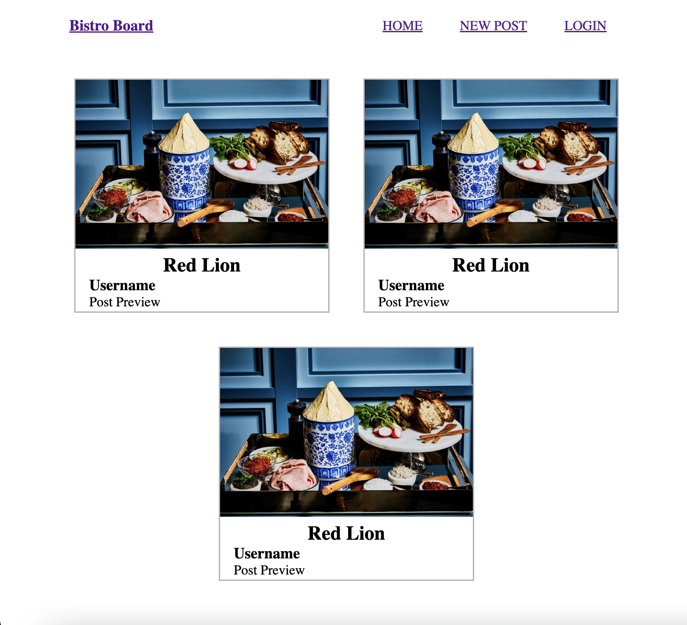

# M14-TechBlog
## Website screenshot 📸

## About this project 🐊

This project was created as a chat board for bistro owners. 

## Usage 🐗

To use this app download the files.
Run npm init and npm i to download dependancies.
Seed data with mysql
npm start